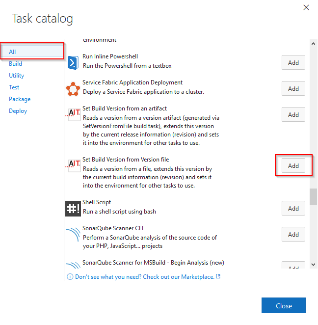
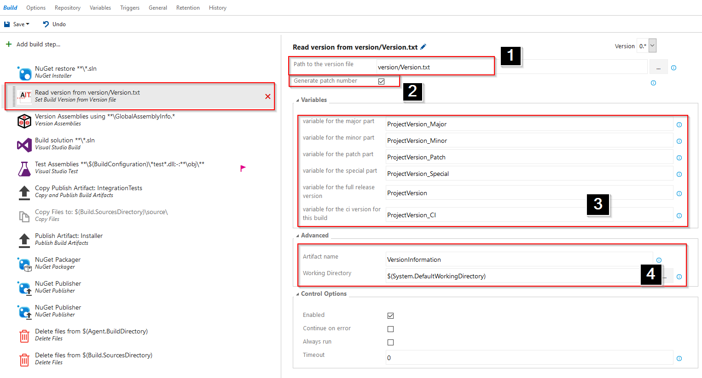
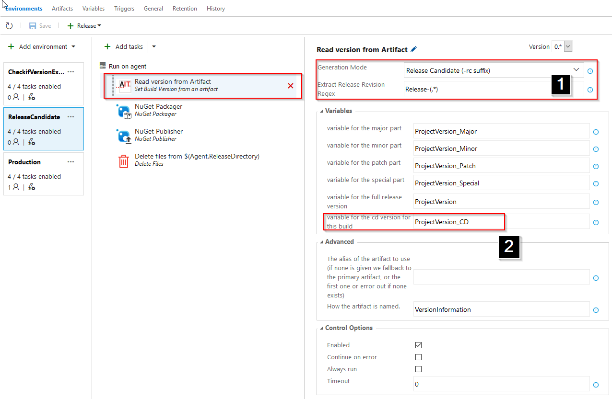
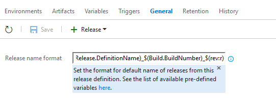

# AIT.VSTS.Versioning

Versioning helpers to version your software by editing a version file in your repository.
This allows you to track your [semantic versioning](semver.org) while doing changes and has the following benefits: 

 - Developers can change the version number right when they are doing the relevant changes
 - On Code-Review it can be checked if the version number was changed correctly.

## Build

See Contribution.md

## How to 

1. Build (see Contribution.md)
2. Install extension (upload on http://tfs.myserver:8080/tfs/_gallery/manage)
   See https://stackoverflow.com/questions/40810914/how-do-you-install-extension-vsix-files-to-tfs-2015-update-3
3. Add a version/Version.txt to your repository only containing a version number, for example "0.0.1"
4. Add the "Set Build Version from Version file" task to your CI Build
   

5. Configure the build to your needs
   

   1. Specify the path to the version file
   2. Allows to generate the patch number from the build number.
      
      > NOTE: This is not compatible to http://semver.org/#spec-item-7 and http://semver.org/#spec-item-8 but some teams prefer to not manage the patch version manually

      This setting currently defines if your file in the repository needs to include the patch number or not. The task with write corresponding error message if done incorrectly!

   3. This section allows to set variables to specific parts of the version number. You can refer to these in later steps.

   4. The version number needs to be forwarded to the release build. You can setu the artifact name which is used for this. You need to refer to this name later in the release task (if you change the name)
  
5. Add the "Set Build Version from an artifact" to your release definition.
6. Configure the release to your needs
   

   1. Specify the release mode. We have to possible release modes

      * The first one is "Release" this will generate just the version you have build. This is typically used for the final environment
      * If you have/want test stages/environment in your release pipeline the release tasks supports releasing "-rc" packages where the exact version is read from the release build currently running.
        This is required as the release can run multiple times for a particular build (with a given version).
        Basically you can set up how tfs generates the release name:
        

        Therefore you need an option to extract the revision part from this custom name. This is what the "Extract Rekease Revision Regex" is for.
    
    2. You generally use the "ProjectVersion_CD" variable to generate and release for example NuGet packages in your later build steps.
